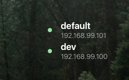

# Docker Machine Übersicht Widget

A simple widget to use with Übersicht to show simplified `docker-machine` output. It's not extensively tested as they were just something quick I put together to get a glance of everything! Feel free to contribute and improve.

Get more widgets at [Übersicht][1]!

## The Result

As you can see, it's pretty simple. Just shows the name of the machine, the corresponding IP (if any), and a running/stopped status.

To enable, place the `dockermachinestats.widget` folder in your `Übersicht/widgets` directory.

## Todo
- Container/image count
- Interactive run/stop/restart
- VM size

[1]: http://tracesof.net/uebersicht-widgets/
